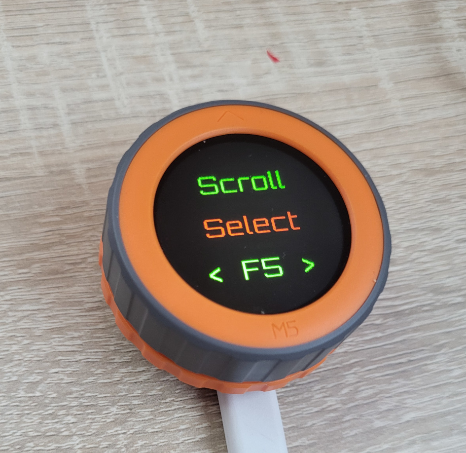
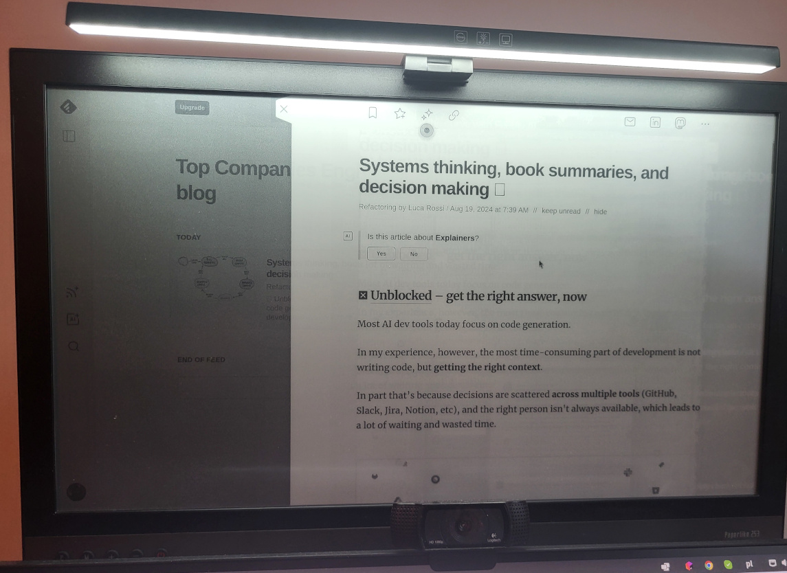

Software to turn [M5 Dial](https://docs.m5stack.com/en/core/M5Dial) to
USB HID device to scroll browser.

Gives ability:
 - scroll with dial
 - select controls with dial (flaky)
 - press on controls
 - refresh browser
 - go back/forward

used for my RSS reader ([e-ink monitor](https://shop.dasung.com/products/dasung-25-3-e-ink-monitor-paperlike-253) + (Raspberry PI 5)[https://www.raspberrypi.com/]):

